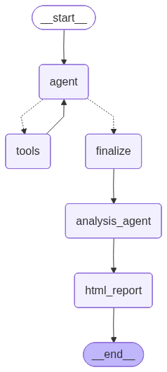
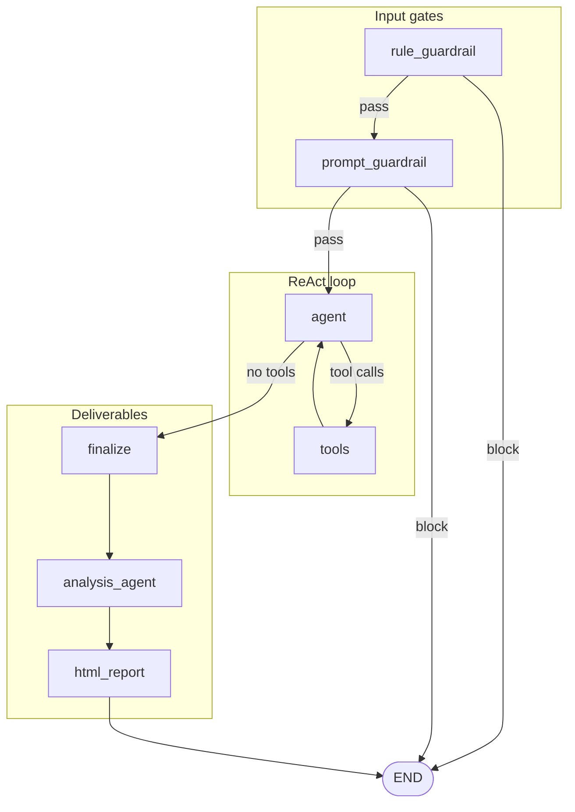

# Adobe Leadership Agent

A **LangGraph**-based leadership assistant that answers business questions using **RAG** over ingested PDFs (filings, reports), optional **Tavily** web search, **Gemini** for reasoning, and an **HTML report** with auto-generated charts. Built for grounded, traceable executive-style Q&A.

---

## What it does

- **Retrieval:** Semantic search over a local **Chroma** vector store (sentence-transformer embeddings) with **MMR** for diversity and optional **Cohere Rerank** (cross-encoder) to reorder candidates for the user’s query.
- **Tools:** `rag_search` (internal docs) and `web_search` (Tavily) inside a **ReAct** loop with **Gemini** (`bind_tools`).
- **Output:** Markdown-style answer, **matplotlib/seaborn** figures from a sandboxed Python step, and a single **HTML** file under `reports/` with narrative + charts + cited sources (including PDF **page** numbers from chunk metadata).
- **Safety:** **Rule-based** guardrails (fast) + **LLM-based** guardrails (structured classification) before the main agent runs.
- **Observability:** Optional **Langfuse** tracing for LangChain/LangGraph runs.

---

## Tech stack

| Layer | Choice |
|--------|--------|
| Orchestration | **LangGraph** (`StateGraph`, conditional edges, SQLite checkpointer) |
| LLM | **Google Gemini** via `langchain-google-genai` (`ChatGoogleGenerativeAI`) |
| Embeddings | **sentence-transformers** `all-MiniLM-L6-v2` (local, HuggingFace) |
| Vector DB | **Chroma** (persistent directory) |
| Reranking | **Cohere Rerank API** (cross-encoder–style scoring) |
| Web search | **Tavily** |
| Viz | **pandas**, **matplotlib**, **seaborn** (subprocess sandbox) |
| Reports | **markdown** → HTML, embedded PNGs |
| Tracing | **Langfuse** (optional) |
| Config | **Pydantic** + `leadership_agent_config.json` |

---

## Repository layout

```
.
├── main.py                      # CLI entrypoint
├── ingest.py                    # Build / refresh Chroma index from PDFs
├── leadership_agent_config.json # Model, RAG, API keys, paths, Langfuse
├── requirements.txt
├── .env.example                 # Optional env overrides (keys, Langfuse)
├── data/
│   └── documents/               # Place *.pdf files here before ingest
├── vectorstore_db/              # Chroma persistence (created by ingest)
├── memory_db/                   # LangGraph SQLite checkpoints (session threads)
├── reports/                     # HTML reports + viz_assets_* chart folders
├── guardrails_config/           # Placeholder / future NeMo-style config
├── templates/                   # Legacy / optional HTML templates
└── src/
    ├── graph/
    │   ├── builder.py           # LangGraph definition (guardrails → agent → … → HTML)
    │   ├── state.py             # `AgentState` TypedDict
    │   ├── react_tools.py       # rag_search, web_search
    │   ├── rule_guardrails.py   # Heuristic input checks
    │   ├── schemas.py           # Pydantic models (e.g. prompt guardrail verdict)
    │   ├── analysis_runner.py   # LLM codegen + subprocess for charts
    │   └── html_report.py       # Single-file HTML report writer
    ├── ingestion/
    │   ├── document_loader.py   # PyMuPDF → LangChain Documents (+ page metadata)
    │   └── chunker.py           # RecursiveCharacterTextSplitter
    ├── utils/
    │   ├── config.py            # Load & validate JSON config
    │   ├── llm_factory.py       # Gemini chat model factory
    │   ├── prompts.py           # System prompts (agent, guardrail, viz)
    │   ├── observability.py     # Langfuse callback builder
    │   └── …
    └── vectorstore/
        ├── store_manager.py     # Chroma build / load
        └── cohere_rerank.py     # Cohere Rerank wrapper
```

---

## Graph structure (and why it’s shaped this way)



*Exported visualization of the compiled graph (core path: `agent` ↔ `tools` → `finalize` → `analysis_agent` → `html_report` → end). The Mermaid diagram below also shows **rule_guardrail** and **prompt_guardrail** before the agent.*



| Stage | Role |
|--------|------|
| **rule_guardrail** | Cheap, deterministic checks (injection phrases, obvious junk, trivial greetings). Fails fast without calling the LLM. |
| **prompt_guardrail** | Same Gemini model with **structured output** (`PromptGuardrailVerdict`) to judge business/leadership fit and subtle policy cases rules miss. |
| **agent** | System prompt + user/history; model may call `rag_search` / `web_search`. |
| **tools** | Executes tool calls, appends `ToolMessage`s, tracks source IDs for tracing. |
| **finalize** | Merges tool outputs into `merged_context`, extracts final assistant text into `final_answer`. |
| **analysis_agent** | Second LLM pass generates **Python** that plots data; runs in isolated temp dir; PNGs copied under `reports/viz_assets_*`. |
| **html_report** | Writes `reports/leadership_report_<timestamp>.html` with answer, figures, and parsed `[SOURCE …]` / `[WEB SOURCE …]` lines. |

**Why this order?** Guardrails before tools avoids wasted retrieval and cost. ReAct is standard for tool-using agents. **Finalize** separates “model answer” from raw tool dumps. **Analysis** runs after the answer so charts can use retrieved numbers + summary. **HTML** last so one artifact bundles narrative, charts, and citations.

---

## Why a cross-encoder reranker (Cohere)?

1. **Bi-encoder retrieval (embeddings)**  
   Each chunk is embedded **independently** of the query. Similarity is fast and scales well, but ranking is based on a single vector per chunk—good **recall**, not always optimal **precision** for a specific question.

2. **Cross-encoder reranking**  
   Cohere Rerank scores **(query, document passage)** jointly. That interaction captures nuances (“this paragraph answers *this* question”) better than cosine similarity alone.

3. **Pipeline used here**  
   - **MMR** retrieves a **diverse** set (`mmr_fetch_k`) so the pool isn’t redundant.  
   - **Rerank** then picks the **top_n** (`mmr_k`) most relevant passages for the exact user query.  

So: embeddings + MMR = broad, non-redundant candidate set; **rerank** = better ordering for the final context window—typical **retrieve → rerank** pattern for production RAG.

---

## Guardrails (summary)

| Type | Where | Behavior |
|------|--------|----------|
| **Rule-based** | `src/graph/rule_guardrails.py` | Blocks empty/tiny input, known injection substrings, short casual-junk intents, trivial-only greetings. Intentionally **not** strict on short business questions—those go to the prompt guardrail. |
| **Prompt-based** | `src/graph/builder.py` + `PROMPT_GUARDRAIL_SYSTEM` | Gemini + Pydantic `PromptGuardrailVerdict` (`allowed`, `brief_reason`). Catches off-topic or policy edge cases after rules pass. |

---

## Setup

### 1. Clone and virtualenv

```bash
cd adobe-leadership-agent
python3 -m venv .venv
source .venv/bin/activate   # Windows: .venv\Scripts\activate
pip install -r requirements.txt
```

### 2. Configuration

- Copy env template (optional):

  ```bash
  cp .env.example .env
  ```

- Edit **`leadership_agent_config.json`**:
  - **`llm.api_key`**: Google AI Studio / Gemini API key (or rely on env if you wire it).
  - **`web_search`**: set `api_key` or `TAVILY_API_KEY` in `.env`.
  - **`rag.cohere`**: set `api_key` and `api_key_env` (`COHERE_API_KEY`) for reranking; set `enabled: false` to skip.
  - **`langfuse`**: set `enabled`, keys, `base_url` (see below).

Secrets can also be supplied via **environment variables** (see `src/utils/config.py` and `.env.example`).

---

## Ingest documents (build the vector store)

1. Put PDFs in **`data/documents/`** (e.g. 10-K, earnings PDFs).

2. Run:

   ```bash
   python ingest.py
   ```

3. This will:
   - Load PDFs with **PyMuPDF** (text per page, `source` + `page` in metadata),
   - Chunk with **`RecursiveCharacterTextSplitter`** (`chunk_size` / `chunk_overlap` from config),
   - Embed with **sentence-transformers** and persist **Chroma** under **`vectorstore_db/`**.

**Re-run ingest** after adding/removing PDFs or changing embedding / chunk settings.

---

## Langfuse (optional tracing)

1. Create a project at [Langfuse Cloud](https://cloud.langfuse.com) (or self-host) and copy **public** and **secret** keys.

2. In **`.env`** (recommended):

   ```env
   LANGFUSE_PUBLIC_KEY=pk-lf-...
   LANGFUSE_SECRET_KEY=sk-lf-...
   LANGFUSE_BASE_URL=https://us.cloud.langfuse.com
   ```

   Or set `langfuse` fields in **`leadership_agent_config.json`** and set `langfuse.enabled: true`.

3. Run **`main.py`** as usual. Traces appear when keys are present and `enabled` is true; if keys are missing, the app runs without tracing (`build_langfuse_callbacks` returns no handlers).

---

## Run the agent

```bash
python main.py
```

- Type a **leadership question** at the prompt; type `exit` to quit.
- Answers print to the terminal; **HTML report** path is appended when generation succeeds.
- **Thread ID** is printed once per session (SQLite checkpointer under `memory_db/` for conversational state).

---

## Configuration reference (quick)

| Key area | File / env |
|----------|------------|
| Gemini model, temperature, tokens | `leadership_agent_config.json` → `llm` |
| Embeddings model | `leadership_agent_config.json` → `embeddings` |
| RAG chunking, MMR, Cohere | `leadership_agent_config.json` → `rag` |
| Tavily | `rag` N/A; `web_search` + `TAVILY_API_KEY` |
| Langfuse | `langfuse` + `LANGFUSE_*` env |
| Paths (docs, DBs, reports) | `leadership_agent_config.json` → `paths` |
| Max ReAct tool rounds | `react_agent.max_tool_rounds` |

---
